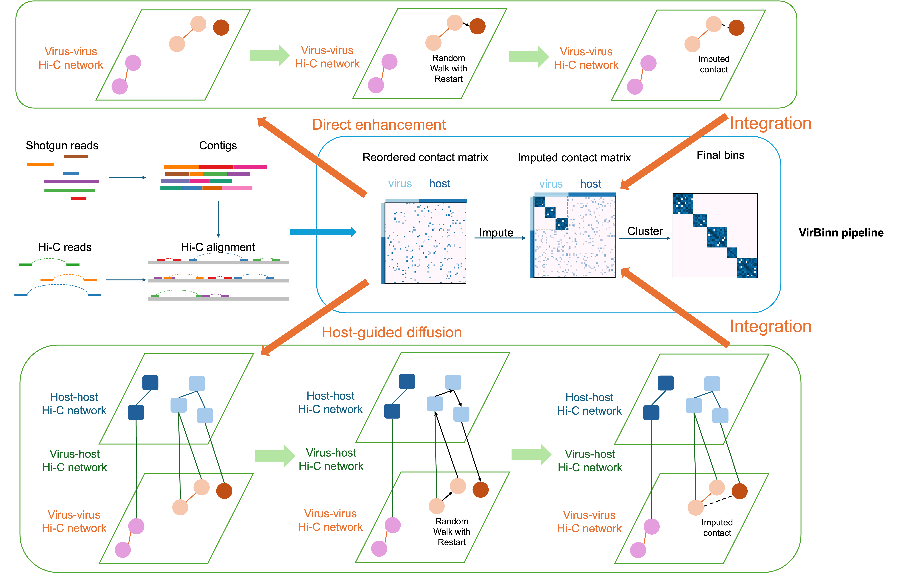

# VirBinn
VirBinn improves viral genome binning from metagenomic Hi-C through graph diffusion.

# Installation

## Hardware
VirBinn is designed to execute efficiently on standard computers or high-performance serverss. 

## Software
**Operating System:** VirBinn v1.0.0 has been tested and validated on **Linux** and **macOS** environments.

**Dependencies:**
The pipeline relies on the Python scientific stack:
* `numpy=1.20.1`
* `scipy=1.6.0`
* `pandas=1.2.2`
* `biopython=1.78`
* `pysam=0.15.3`
* `scikit-learn=0.24.1`
* `leidenalg=0.8.3`
* `python-igraph=0.8.3`
* `tqdm=4.58.0`

## Installation Guide

To ensure all C-based dependencies (such as `pysam` and `leidenalg`) interact correctly, we recommend managing the installation via [**Conda**](https://docs.conda.io/projects/conda/en/latest/user-guide/index.html).

### 1. Clone the repository
Clone the repository using git:

```bash
git clone https://github.com/dyxstat/VirBinn.git
cd VirBinn
```

### 2. Configure the Environment
We provide configuration files for Linux and macOS to install the packages.

**For Linux Users:**
```bash
conda env create -f virbinn_env.yaml
```

**For macOS Users:**
```bash
conda env create -f virbinn_osx_env.yaml
```

### 3. Activate
Once the environment creation is finished, activate it to start using the tool:

```bash
conda activate virbinn_env
```

## Installation Verification

We provide a built-in test command to verify that VirBinn is correctly installed and that all library dependencies are loaded properly.

```bash
python virbinn.py test --OUTDIR Test/check_install
```

* **Success:** The command will run silently and exit without errors. A directory named `Test/check_install` containing a log file will be created.
* **Failure:** If the environment is not set up correctly, Python will raise an `ImportError` or `ModuleNotFoundError`.

## Demo Data
To help you get started quickly, the `Test/` directory includes a small simulated dataset:
```
Test/final.contigs.fa
Test/MAP_SORTED.bam
Test/viral_contigs.txt
```

You can verify the software by running it on this data.


# Usage
Once the environment is set up, you can run VirBinn. The pipeline is designed as a modular process consisting of three main stages: **raw contact matrix construction**, **imputation**, and **binning**. These steps should be run sequentially, as the output of one step is the input for the next.

You can view the overall workflow of VirBinn below:



## Data Preparation
Before starting the pipeline, ensure your input data meets the following criteria:
1.  **Assembly (FASTA):** Your metagenomic assembly.
2.  **Viral List (TXT):** A text file containing the headers of identified viral contigs (one per line, no header).
3.  **Hi-C Alignment (BAM):** Hi-C reads aligned to your assembly. The BAM file must be sorted by query name to ensure paired-end reads are processed correctly.

```bash
# Sort your alignment file by name using samtools
samtools sort -n -o sorted_by_name.bam coordinate_sorted.bam
```

## Running the Pipeline

### Step 1: Raw Contact Matrix Construction
The first module calculates physical contact frequencies between contigs based on restriction enzyme cutting sites.

```bash
python virbinn.py raw [OPTIONS] FASTA_FILE BAM_FILE OUTDIR
```

**Required Arguments:**
* `FASTA_FILE`: Path to the reference assembly.
* `BAM_FILE`: Path to the **name-sorted** Hi-C BAM file.
* `OUTDIR`: Directory for outputting intermediate matrices.
* `-e, --enzyme`: The restriction enzyme used in your Hi-C library (e.g., `-e HindIII`). *Note: This flag can be used multiple times for multi-enzyme cocktails.*

**Optional Parameters:**
* `--min-len`: Filter out contigs shorter than this threshold (default: 1000).
* `--min-mapq`: Minimum mapping quality for a read to be considered (default: 30).

### Step 2: Imputation
The second module refines the sparse contact matrix using a Random Walk with Restart (RWR) algorithm to recover missing edges.

```bash
python virbinn.py impute [OPTIONS] VIRAL_LIST OUTDIR
```

**Required Arguments:**
* `VIRAL_LIST`: Text file listing viral contig names.
* `OUTDIR`: The output directory (must be the same directory used in Step 1).

**Optional Parameters:**
* `--discard-viral`: Threshold for retaining viral edges (default: 50).
* `--discard-host`: Threshold for retaining host edges (default: 80).

### Step 3: Binning
The final module performs clustering using the Leiden algorithm to group viral contigs into genomic bins.

```bash
python virbinn.py bin [OPTIONS] FASTA_FILE OUTDIR
```

**Required Arguments:**
* `FASTA_FILE`: The original reference assembly.
* `OUTDIR`: The output directory (must be the same directory used in Step 1 & 2).

**Optional Parameters:**
* `--output-prefix`: A string prefix for the resulting cluster files (default: `viral2bin`).

## Output Files
Upon completion, the `OUTDIR` will contain several key files:

| File / Folder | Description |
| :--- | :--- |
| **`VIRAL_BIN/`** | A directory containing individual FASTA files for each recovered viral bin. |
| **`viral2bin_clusters.txt`** | A tab-delimited file mapping each viral contig to its assigned bin ID. |
| **`contig_info.csv`** | Summary metrics (length, site count) for the processed contigs. |
| **`VirBinn.log`** | Detailed runtime logs for troubleshooting. |
